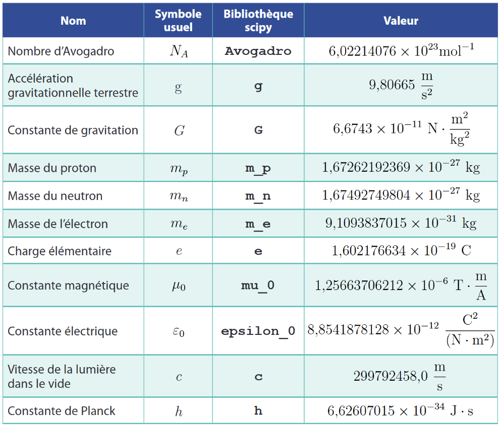
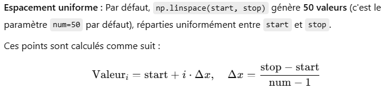
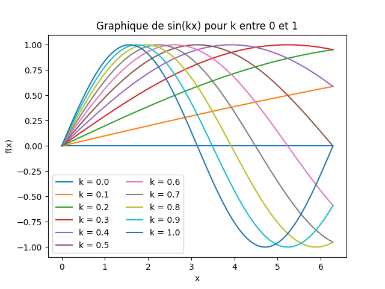

# Rappels de programmation

Ceci est un rappel des notions vues en *programmation en sciences* à la session 2. Ce rappel se base sur le livre *Programmation en sciences de la nature* par les auteurs Sébastien Huneault, Olivier Rousseau et Charles Varin, des éditions CEC. 

Dans les notes ci-dessous, les notions sont résumées et on consolide avec des exercices dirigés ou autonome, avec corrigé. 

Les éléments mis entre crochets lors de l'explication de la syntaxe signifient que l'élément entre crochets est à remplacer par une valeur.

En tout temps, n'hésitez pas à utiliser les outils à votre disposition. L'important est de produire le bon résultat et de COMPRENDRE ce qui est écrit. Voici de la documentation pertinente à consulter en ligne:

- https://docs.python.org/3/
- https://www.w3schools.com/python/
- Voir le dossier "z-documentation_supp" pour plein d'informations sur divers sujet à traiter en Python. 
- ChatGPT est aussi un bon allié pour s'inspirer, se faire expliquer et apprendre des syntaxes rapidement.
- Comprendre et lire l'anglais est un très bon atout si vous désirez continuer en programmation.

## Variables

### Affectation de valeur à une variable
Une variable est un objet que l'on nomme et auquel il est possible d'attribuer une valeur ou une expression. La variable peut être utilisée et modifiée (en remplaçant sa valeur). Pour affecter une valeur à une variable, il est primordial d'utiliser le symbole = et de mettre le nom de la variable à gauche de l'égalité.

[nom variable] = [valeur à mettre dans la variable]

```py
# attribuer la valeur de 7 dans la variable nommée x
x = 7
```

L'interprétation d'un programme se fait de haut en bas. Dans l'exemple ci-dessous, que vaudra la variable *vitesse* après la lecture du programme de quelques lignes ci-dessous?

```py
vitesse = 0
temps_deplacement = 15   # remarquez la nomenclature avec la barre de soulignement
deplacement_metres = 10

vitesse = deplacement / temps
```

Voir les [règles de nomenclature ici](01-Rappels\00-Nommenclature.md)

### Types
Les variables peuvent être de plusieurs types: entier, décimal, chaîne de caractères (str), booléen, etc.

```py
a = 56 # entier
b = 45.5 # décimal
c = "bonjour"  # chaîne (appelée string ou str)
d = False 
```

On a aussi la possibilité de définir des constantes. Celles-ci seront toujours en majuscule

```py
G = -9.81
TAXES = 0.15
```

#### Notation scientifique

Il est possible d'écrire ou de lire des nombres qui sont présentés en notation scientifique. Par exemple:

```py
rayon_de_la_terre = 6.37e6   # 6.37 x 10^6 = 6 370 000
print(rayon_de_la_terre)
print(f"{rayon_de_la_terre:e}") # notation scientifique
print(f"{rayon_de_la_terre:.2e}") # notation scientifique avec 2 décimales
print(f"{rayon_de_la_terre:.2f}") # notation décimale avec 2 décimales
print(f"{rayon_de_la_terre:.3}") # 3 chiffres significatifs
```

### Affectation multiple sur une ligne

En Python, il est possible d'affecter plusieurs valeurs à plusieurs variables en même temps sur une ligne. On peut aussi écrire en *f-string*, ce qui permet d'intégrer directement des expressions ou des variables dans une chaîne en les entourant d'accolades {}.

```py
x,y,z = 2,5,6
print(f"La valeur de x est {x}")
print(f"La valeur de y est {y}")
print(f"La valeur de z est {z}")

division = y/z
print(f"La valeur de {y} divisé par {z} est {division:.2f}") 
```

L'expression .2f, précisément pour la variable division, indique d'arrondir la variable *division* à 2 décimales.

### Input()

Il peut être intéressant de faire interagir l'utilisateur avec le code. Il est possible de demander à l'utilisateur d'écrire une valeur qu'on affecte à une variable et qui suit l'algorithme ensuite. 

Attention!!
```py
nombre = input("Entrez un nombre: ") # la valeur entrée sera stockée dans la variable nombre, mais sera en format string (str)
print(nombre * 2) # ceci donnera donc une chaîne de caractère avec 2x le nombre écrit côte à côte.
```

Bonne façon:
```py
nombre = int(input("Entrez un nombre: ")) # on convertit la valeur en int
print(nombre * 2) # On aura le double du nombre!
```

### Conversion de type de variable

Il est possible de convertir une valeur ou une variable d'un type à un autre. On peut vouloir, par exemple, convertir un nombre décimal en entier afin de l'utiliser dans un calcul. 

```py
nombre = 4.6
nombre_entier = int(nombre) # nombre_entier vaut alors 4
```
| fonction | Colonne 2 | Colonne 3 |
|-----------|-----------|-----------|
| int()   | Transforme en entier | int("36") --> 36  |
| float()  | Transforme en nombre flottant | float(36) --> 36.0  |
| str()   | Transforme en texte | str(36) --> "36" |
| bool()  | Transforme en booléen | bool(36) --> True |
|||

> Il sera très utile de d'utiliser la conversion vers un nombre lorsqu'on récolte la réponse d'un utilisateur, entre autres.

### Symboles mathématiques

Voici un rappels des diverses manières d'écrire les symboles math

| **Opération**            | **Symbole Python** | **Exemple**          | **Résultat** |
|--------------------------|--------------------|----------------------|--------------|
| Addition                 | `+`               | `3 + 2`              | `5`          |
| Soustraction             | `-`               | `5 - 3`              | `2`          |
| Multiplication           | `*`               | `4 * 2`              | `8`          |
| Division                 | `/`               | `9 / 2`              | `4.5`        |
| Division entière         | `//`              | `9 // 2`             | `4`          |
| Modulo (reste)           | `%`               | `9 % 2`              | `1`          |
| Puissance (exponentiation)| `**`              | `2 ** 3`             | `8`          |
| Racine carrée | `numpy.sqrt()`     | `numpy.sqrt(16)`      | `4.0`        |
| Valeur absolue           | `abs()`           | `abs(-7)`            | `7`          |


### Constantes avec scipy

Pour accéder à des constantes connues, on peut utiliser plusieurs librairies, dont celle-ci: scipy

```py
import scipy.constants as cst
```

On peut ensuite utiliser plusieurs constantes:


*Source : Livre Programmation en sciences de la nature* <br>
*[Liste complète](https://docs.scipy.org/doc/scipy/reference/constants.html) des variables*


Exemple: Calculons la distance en mètres parcourus par la lumière dans l'espace après 5 ans
```py
nombre_annees = 5

distance = int(nombre_annees * cst.year * cst.c)

> cst.year représente le nombre de secondes dans une année et cst.c est la vitesse de la lumière dans le vide.

print(f"La distance parcourue par la lumière en {nombre_annees} ans est {distance} mètres")

```

### [Exercices variables](02-Exercice_variables.md)


## Les_fonctions

En plus des fonctions prédéfinies comme print(), input(), len() et plusieurs autres, on a aussi vu comment faire des fonctions personnalisées. Les fonctions sont utiles pour regrouper une logique dans un bloc de code réutilisable en évitant le copier-coller. Une fonction peut prendre des valeurs en entrée et fournir une sortie. 

La syntaxe est la suivante (ne pas oublier que les éléments entre crochets sont facultatifs). Le return n'est pas toujours nécessaire non plus.

```py
def nom_fonction([paramètre 1], [paramètre 2], ...):
    ...instructions à exécuter...
    return [valeur_à_retourner]
```

#### Exemple 1:

Faisons une fonction qui prend un x et qui retourne le résultat de ce *x* passé à la fonction $f(x) = 3x^4 -2x^2+18$

```py
def f(x):
    return 3*x**4 - 2*x**2 + 18

x = int(input("Entrez une valeurs de x: "))
print(f"En prenant x qui vaut {x}, on obtient f(x) qui vaut {f(x)}")
```

#### Exemple 2:

Écrivez une fonction qui calcule la force gravitationnelle entre deux objets en fonction de leurs masses et de la distance qui les sépare. La formule utilisée est :

$$
F = (G \cdot m_1 \cdot m_2) / r^2   
$$

- Manière 1: passer les valeurs de $m_1$, $m_2$ et $r$ en paramètres pour faire le calcul.

```py
# la fonction
def force_gravitationnelle(m1,m2,r):
    return cst.G * m1 * m2 /r**2

# À l'extérieur de la fonction, les 3 appels à l'utilisateur
masse1 = float(input("masse 1 (kg) : "))
masse2 = float(input("masse 2 (kg) : "))
distance = float(input("distance entre les masses (m) : "))

# l'appel à la fonction avec les 3 valeurs
print(f"La force est: {force_gravitationnelle(masse1,masse2,distance)} N")
```

- Manière 2: ne passer aucun paramètres et demander les 3 valeurs en input pendant l'exécution de la fonction.

```py
def force_gravitationnelle2():
    masse1 = float(input("masse 1 (kg) : "))
    masse2 = float(input("masse 2 (kg) : "))
    distance = float(input("distance entre les masses (m) : "))
    return cst.G * masse1 * masse2 /distance**2


print(f"La force est: {force_gravitationnelle2()} N")
```


## Les_conditions

Les conditions permettent de contrôler l'exécution d'un programme en fonction de certaines conditions. Elles sont utilisées pour faire des choix dans le code en fonction des valeurs des variables, des résultats d'expressions, ou d'autres critères.

Python utilise des mots-clés pour définir les conditions :

- if : Exécute un bloc de code si la condition est vraie.
- elif (abréviation de "else if") : Permet de tester d'autres conditions si la condition initiale if est fausse.
- else : Exécute un bloc de code si toutes les conditions précédentes sont fausses.

```py
if condition1:
    # Code exécuté si condition1 est vraie
elif condition2:
    # Code exécuté si condition2 est vraie et condition1 est fausse
else:
    # Code exécuté si toutes les conditions précédentes sont fausses
```

Exemple:
```py
x = int(input("Entrez un nombre: "))

if x > 0:
    print("Le nombre est positif.")
elif x < 0:
    print("Le nombre est négatif.")
else:
    print("Le nombre est nul.")
```

Les conditions utilisent des opérateurs de comparaison pour tester des valeurs :

| Opérateur | Signification            | Exemple      |
|-----------|--------------------------|--------------|
| `==`      | Égal à                   | `5 == 5` → `True`  |
| `!=`      | Différent de             | `5 != 3` → `True`  |
| `>`       | Plus grand que           | `5 > 3` → `True`   |
| `<`       | Plus petit que           | `3 < 5` → `True`   |
| `>=`      | Supérieur ou égal à      | `5 >= 5` → `True`  |
| `<=`      | Inférieur ou égal à      | `3 <= 5` → `True`  |

### Conditions multiples

Il est possible de combiner plusieurs conditions à l’aide des opérateurs logiques :

- and : Toutes les conditions doivent être vraies.
- or : Au moins une des conditions doit être vraie.
- not : Inverse la condition.

```py
age = 20
if age >= 18 and age <= 35:
    print("L'âge est compris entre 18 et 35 ans.")
```


## Les_listes

Pour créer une liste, il faut déclarer un nom, suivi du symbole d'égalité puis des valeurs à mettre dans la liste, entre crochets [], entrecoupés de parenthèses.

```py
nombres = [3,6,1]
print(nombres)
```

Pour accéder à un élément de la liste, il faut appeler son indice. RAPPEL: le premier élément d'une liste a un indice de 0.

```py
print(nombres[0])
print(nombres[1])
print(nombres[2])

# On peut aussi y aller à l'envers:
print(nombres[-1]) # dernier
print(nombres[-2]) # avant-dernier
print(nombres[-3]) # avant-avant-dernier

print(len(nombres)) # pour imprimer la quantité de valeurs dans la liste
```

### Numpy et les listes

Pour pouvoir remplir une liste avec plusieurs valeurs qui suivent une régularité, on utilise la librairie Numpy, à écrire avant d'en avoir besoin. 

On peut ainsi remplir une liste avec, par exemple, des valeurs de 1 à 100 comme ceci:

```py
import numpy as np  
valeurs_x = np.linspace(1,100,100) 
print(valeurs_x) #pour voir le résultat
```

Voici tous les détails de la fonction linspace:
```py
np.linspace(start, stop, num=50, endpoint=True, retstep=False, dtype=None)

```
Les détails de la fonction [linspace](https://numpy.org/doc/2.1/reference/generated/numpy.linspace.html)

> Note: le calcul des valeurs se fait comme ceci:



**RAPPEL**: On doit placer les paramètres en ordre dans les parenthèses d'appel, sinon on doit nommer le paramètre et donner sa valeur avec le symbole =.


Il existe aussi **arange**:

La fonction numpy.arange génère un tableau de nombres selon un intervalle donné et un pas spécifié. Contrairement à np.linspace, elle ne garantit pas un nombre précis de valeurs mais produit une séquence de nombres en fonction du pas.


```py
np.arange(start, stop, step, dtype=None)
```

- start : Valeur de départ (inclus, par défaut 0).
- stop : Valeur de fin (exclus).
- step : Pas entre chaque valeur (par défaut 1).
- dtype : Type de données (facultatif).

### Opérations sur les listes

On peut faire plusieurs manipulations sur les valeurs dans les listes numériques. Prenons une liste de températures en Celsius et faisons quelques manipulations:

```py
temperatures_liste = [-27, 19, -17, -21, 50, 33, 17, -28, 46, -18, 26, 40, 30, -21, 40]
```

1. Trouver la valeur maximale et minimale de la liste

```py
maximum = max(temperatures_liste)
minimum = min(temperatures_liste)
print(maximum)
print(minimum)
```

2. Mettre la liste en ordre croissant ou décroissant

```py
temperatures_liste.sort()
print(temperatures_liste)
temperatures_liste.sort(reverse=True)
print(temperatures_liste)
```

3. Faire un calcul sur tous les éléments de cette liste

- Pour réussir à changer chaque élément d'une liste en appliquant un calcul mathématique, on peut s'y prendre de 2 manières:

    - En utilisant un array (outil offert par la librairie Numpy): 
    ```py
    temperatures_array = np.array([-27, 19, -17, -21, 50, 33, 17, -28, 46, -18, 26, 40, 30, -21, 40])
    temperature_fahrenheit = temperatures_array * 9 / 5 + 32

    print(temperature_fahrenheit)
    ```
    - En utilisant une boucle (Sur une liste ordinaire, pas un array) <br>
    Voir la section suivante pour les détails et explications
    ```py
    print(temperatures_liste) # avant
    for i in range(len(temperatures_liste)):
        temperature_fahrenheit[i] = temperatures_liste[i] * 9/5 + 32
    
    print(temperature_fahrenheit) # après
    ```
    
    En Python, en faisant des recherches sur internet, vous verrez souvent des contractions de code. Par exemple, on peut faire une boucle comme ceci. Le langage Python offre plusieurs syntaxes différentes pour faire des commandes.

    ```py
    temperatures_celsius = [-27, 19, -17, -21, 50, 33, 17, -28, 46, -18, 26, 40, 30, -21, 40]

    temperatures_fahrenheit = [temp * 9/5 + 32 for temp in temperatures_celsius]
    #note: temperature_fahrenheit est un array et non une liste ordinaire
    ```


## Les_boucles

Pour parcourir les listes (comme vu dans le dernier exemple de la section des listes) ou pour répéter une instruction à plusieurs reprises, il est souvent nécessaire d'utiliser des boucles. Il en existe 2 types en Python. Les boucle for et les boucles while

### Boucles for

La boucle for est utile quand le nombre de répétitions est connu d'avance. La syntaxe est la suivante:

```py
for [variable] in [nom de la liste]:
    [instruction]
```
ou encore:

```py
for [variable] in range([nombre de fois]):
    [instruction]
```

Nous avons souvent utilisé la longueur d'une liste dans le range. Par exemple ici, si on veux additionner chaque élément d'une liste:

```py
somme = 0
for element in temperatures_liste:
    somme = somme + element

```

Nous avons aussi vu qu'on pouvait utiliser l'**indice** de l'élément de la liste pour accéder au contenu de celle-ci:

```py
somme = 0
for i in range(len(temperatures_liste)):
    somme = somme + temperatures_liste[i]

print(somme)
```

La fonction range() peut aussi avoir des paramètres spécifiés:

```py
range([début], [fin], [saut])
```
La fin du range est EXCLUT du calcul. Donc un range(1,5) sera en fait 4 répétitions: 1,2,3,4. 

Combien de répétition fera-t-on dans range(5,18)?

#### Exemple:
Si on souhaite calculer la somme des nombres de 1 à n avec une répétition. on peut faire ceci: 

```py
n = 10
somme = 0
for i in range(1,n):
    somme += i

print(f"La somme des nombres de 1 à {n} exclut est {somme}")
```

#### Exercice plus complexe (chute libre):

Supposons que l'on s'intéresse à la position d'un objet en chute libre et qu'on veuille la hauteur de cet objet à chaque seconde. La formule physique qui correspond à ce besoin est:

$$
h(t) = h_0-0.5gt^2
$$
où 

- $h(t)$ est la hauteur (en mètres)
- $h_0$ est la hauteur initiale (en mètres)
- $g$ est l'accélération due à la gravité ($g=9.8 m/s^2$)
- $t$ est le temps écoulé (en secondes)

Pour résoudre cette demande, on doit écrire l'algorithme suivant dans Python:
1. initialiser les valeurs connues et choisir une hauteur initiale
2. calculer le temps nécessaire avant que l'objet ne touche le sol. Un peu d'algèbre ici
3. Faire une boucle qui parcoure tous les temps de 0 au temps d'atteinte au sol et calculer la hauteur pour chaque moment. Afficher la hauteur pour chaque moment dans une phrase. 

Si on fait l'exercice en le testant pour 100 mètres, on obtient la sortie suivante:

```py
Temps 0 s: Hauteur = 100.00 mètres
Temps 1 s: Hauteur = 95.10 mètres
Temps 2 s: Hauteur = 80.40 mètres
Temps 3 s: Hauteur = 64.80 mètres
Temps 4 s: Hauteur = 48.30 mètres
Temps 5 s: Hauteur = 30.90 mètres
Temps 6 s: Hauteur = 12.60 mètres
Temps 7 s: Hauteur = -6.80 mètres
```


### Boucles while

La boucle while est également utilisée lorsque vous ne savez pas à l'avance combien de fois il faudra exécuter la boucle. Elle s'exécute tant que la condition est vraie. Elle peut s'exécuter 0 fois, sa la condition d'entrée n'est jamais vraie. La syntaxe de base en Python est la suivante:

```py
while condition:
    instructions
```

condition : une expression booléenne qui est évaluée avant chaque itération de la boucle.
Si la condition est vraie (True), le bloc d'instructions est exécuté.
Si la condition est fausse (False), la boucle ne s'exécute pas à nouveau.


À la fin de chaque exécution (liste d'instructions indentées dans le while), la condition est revérifiée au départ pour savoir si on refait à nouveau les instructions.

Exemple simple:

```py
nombre = 100

while nombre > 3:
    nombre = nombre / 2
    print("un tour de boucle a été fait")
```
Autre exemple (on ne sait pas combien de fois on devra faire la boucle):

```py
reponse = int(input("Veuillez entrer un nombre positif différent de 0 qui se divise par 4 et 5: "))

while reponse <= 0 or reponse % 4 != 0 or reponse % 5 != 0 :
    reponse = int(input("Erreur, veuillez recommencer. Entrer un nombre positif qui se divise par 4 et 5: "))
    
print("bravo!")
```

### Boucles infinies

Avec les boucles, particulièrement les boucles while, peuvent causer ce qu'on appelle une boucle infinie si la condition n'est pas bien implémentée:

Par exemple, 

```py
mesure1 = 30
mesure2 = 30

while mesure1 <= mesure2:
    mesure1 = mesure1/2
    print(mesure1)
```

Le print nous permet de voir que la boucle est infinie, mais s'il n'y en n'a pas, la façon de la détecter est plus subtile.

## Les_graphiques

Pour tracer des graphiques, la librairie matplotlib.pyplot demeure d'actualité. 

```py
import matplotlib.pyplot as plt  
```

Pour afficher un graph plusieurs éléments sont utiles pour afficher des relations (ou fonctions) avec les paramètres esthétiques désirés.

```py
def f(x):
    return x**3

plt.figure(figsize=(9, 6))
valeurs_x = np.linspace(-10,10)  #Pour générer une liste de valeurs de 
                                    #-10 à 10 en 50 points (valeurs par défaut). 
valeurs_y = f(valeurs_x)  #On appelle la fonction f(x) avec la liste valeurs_x

plt.plot(valeurs_x, valeurs_y)   #on crée un objet "graphique" (plot)

# Les titres d'axes et le titre
plt.xlabel('x')      #titre de l'axe des x
plt.ylabel('f(x)')      #titre de l'axe des y
plt.xticks([-10,-5,0,5,10])   #graduation de l'axe des x
plt.yticks([-1000,-500,0,500,1000])   #graduation de l'axe des y
plt.title('Graphique de la fonction $f(x) = x^3$')

# Ajout des axes plus foncés passant par (0,0)
plt.axhline(0, color='black', linewidth=1.2)
plt.axvline(0, color='black', linewidth=1.2)

# Afficher le graphique
plt.grid(True)   #la commande pour mettre les quadrillages
plt.show()  #la commande pour afficher le graph
```

### Exercices:

1) Faire le graphe de la fonction $$ h(x) = 2x^3+5x^2+8x-12$$ 

2) Faire le graphe de la fonction $$ g(x) = sin(2x-\pi) $$

> note, pour faire le sin(x) dans la fonction à laquelle on passe une liste, utilisez np.sin()

Il existe une multitude de paramètres dans la fonction plot(). Voici le lien vers la documentation de Matplotlib, avec des détails et exemple. Les possibilités sont grandes! Voici un aperçu:

https://matplotlib.org/stable/api/pyplot_summary.html 


### Sections de graphiques

Il est possible d'afficher plusieurs graphiques sur une même figure en utilisant la fonction *plt.subplot()*. 

```py
plt.subplot([nb_lignes], [nb_colonne], [position])
```

Exemple:
```py
import numpy as np
import matplotlib.pyplot as plt

plt.suptitle("Exemple d'utilisation de subplot()")

x = np.linspace(0, 2*np.pi, 100)

plt.subplot(2, 1, 1)
plt.grid(True)
plt.plot(x, np.sin(x))
plt.ylabel("sin(x)")
plt.xlabel("x")

plt.subplot(2, 1, 2)
plt.grid(True)
plt.plot(x, np.cos(x))
plt.ylabel("cos(x)")
plt.xlabel("x")

plt.tight_layout()
plt.show()
```

On peut aussi mettre plusieurs courbes dans le même graphique:

```py
import numpy as np
import matplotlib.pyplot as plt

plt.title("Graphique de sin(kx) pour k entre 0 et 1")

k = 1
x = np.linspace(0, 2*np.pi, 100)

for k in np.arange(0, 1.1, 0.1):
    fx = np.sin(k*x)
    plt.plot(x, fx, label=f"k = {np.round(k,2)}")

plt.xlabel("x")
plt.ylabel("f(x)")

plt.legend(ncols=2) #Nopmbre de colonnes de la légende
plt.show()
```

Résultat:




## Les_fichiers

Avec Python, il est très utile de traiter des fichiers externes pour parvenir à en faire l'analyse. 

Jusqu'à présent, en programmation 1,  nous avions vu comment importer des fichiers de type .csv à l'aide de la librairie Pandas. Celle-ci facilitait grandement la manipulation de ce type de fichier particulier.

Par exemple, si on reprend l'exercice faite l'an dernier sur l'éclipse solaire d'avril:

```py
# Importer la librairie pandas. L'alias utilisé dans la documentation est l'alias pd. 
import pandas as pd

# Lire le fichier CSV. df est un terme utilisé pour datafile. Encoding = "latin1" est pour s'assurer que les caractères francophones soient pris en charge
data = pd.read_csv("eclipse_solaire.csv", encoding = "utf-8")

# Afficher un résumé des 5 premières lignes
print(data.head())
```

On peut mettre les valeurs de la première colonne (par exemple), dans une liste dans le but d'y faire des manipulations:

```py
liste = df.iloc[:, 0].tolist()   #toutes les lignes de la colonne 0 (la première)
```

La suite des manipulations effectuées se trouvent dans le fichier eclipse_solaire.py


Il est aussi possible d'ouvrir pratiquement n'importe quel *type* de fichier pour en lire et interpréter le contenu:

```py
with open([nom du document], [options]) as [nom de variable]:
    [instruction de lecture ou écriture]
```

Pour écrire dans un fichier de type texte (.txt), on utilise write (w):
```py 
with open("demo.txt", "w") as f:
    f.write("Voici du texte!\n")
```
Lors de l'exécution du programme, s'il n'existe pas déjà, le fichier sera créé. Si on garde l'option "w", le fichier complet sera écrasé lors de la prochaine écriture. Pour éviter cela, on utilise "a"

```py 
with open("demo.txt", "a", encoding='utf-8') as f:
    f.write("Voici du texte sans écraser le précédent!\n")
```

Il est possible d'écrire plusieurs éléments, d'y insérer des variables également:

```py
with open("demo.txt", "a", encoding='utf-8') as f:
    n = 7
    f.write(f"La racine carrée de {n} est: {np.sqrt(n)}")
```

Toutefois, il est très utile de savoir que chaque type de fichier et les traitements courants associés ont souvent une librairie associée pour faciliter chaque opération.