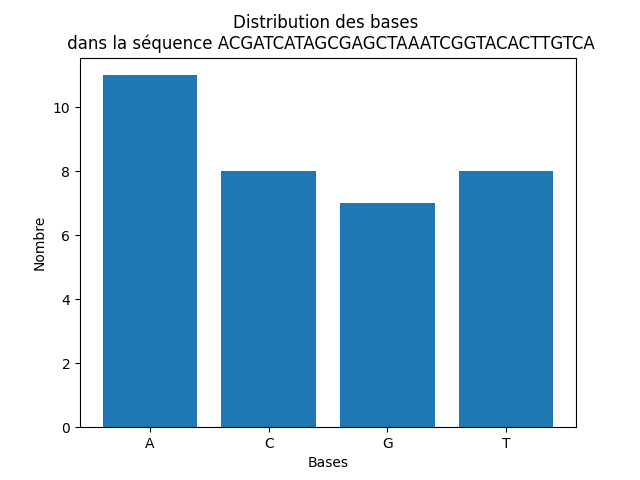

# Exercices graphiques

## Question 1

En physique, l'approximation des valeurs de $sin(x)$ se fait par la fonction $x$ pour de petits angles. 
1. Tracez, sur un même graphique, $x$ et $sin(x)$ sur l'intervalle [-2,2].
2. Changez l'intervalle pour [-0.5, 0.5]. Est-ce que l'approximation devient meilleure?
3. Pour la fonction $cos(x)$, l'approximation des petits angles se fait plutôt avec $cos(x) \approx  1- x^2/2 $. Tracez le graphique de cette approximation dans un sous graphique inclut avec $sin(x)$ et $x$.

## Question 2

Trouvez comment faire pour afficher un histogramme. Dans l'exercice suivant, on affiche la fréquence des différente bases dans une séquence d'ADN. La séquence est la suivante: "ACGATCATAGCGAGCTAAATCGGTACACTTGTCA"

L'histogramme en question devrait ressembler à ceci:

Fouillez pour comprendre comment accumuler la fréquence de chaque lettre, créer un graph. Voici quelques idées ou mots pour vous guider:
- Automatiser le décompte du nombre de valeurs pour chaque lettre
- plt.subplots()
- ax.bar()

Trouvez un moyen de changer l'apparence du diagramme. Cherchez ensuite comment faire un histogramme plutôt qu'un diagramme à bandes.

[Retour](01-Rappels.md#Les_graphiques)