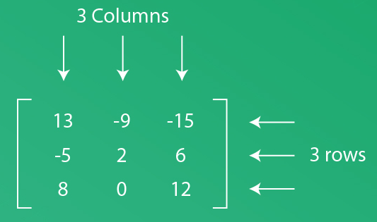

## Graphiques 3D

On peut aussi faire des graphiques en 3D avec les librairies numpy et matplotlib.pyplot. Si on souhaite que le résultat 3D donne l'effet d'une surface 3D, on peut s'y prendre comme ceci:

### La base

Pour afficher un graphe 3D, on a besoin d'un plan cartésien 3D. Il faut minimalement:

```py
import matplotlib.pyplot as plt

fig = plt.figure()
ax = plt.axes(projection='3d') # crée un OBJET Axes3D, pour avoir accès aux fonctionnalités 3D
plt.show()
```
* ax est le nom d'une instance d'objet Axes. Si on est en 2D, cet objet se crée implicitement lorsqu'on commande un graphique (plt.plot par exemple). En 3D, on doit préciser l'intention d'avoir 3 axes, il faut donc le mentionner explicitement.


### surface 3D

Disons qu'on veuille illustrer la fonction 

$sin(\sqrt(X^2+Y^2))$

sur un carré $[-5, 5] \times [-5,5]$, on s'y prend comme suit:

```py
import numpy as np
import matplotlib.pyplot as plt

x = np.linspace(-5, 5, 30)  
y = np.linspace(-5, 5, 30)  
X, Y = np.meshgrid(x, y)  # meshgrid pour faire un grillage x par y
Z = np.sin(np.sqrt(X**2 + Y**2))  


fig = plt.figure(figsize=(8, 6))
ax = fig.add_subplot(111, projection='3d')


ax.plot_surface(X, Y, Z, cmap='coolwarm')


ax.set_xlabel("X")
ax.set_ylabel("Y")
ax.set_zlabel("Z")
ax.set_title("Exemple de surface 3D")

plt.show()
```

### Meshgrid

Utilisons la fonction meshgrid pour se pratiquer à fouiller et trouver l'information pertinente sur une fonction.

L'utilisation de meshgrid est nécessaire pour faire un graphique 3D, il s'agit d'une fonction prédéfinie de numpy. Pour bien comprendre son fonctionnement, on peut se référer à la documentation officielle pour mieux comprendre. Une simple recherche Google suffit pour trouver la signification de la fonction. Ce qui est important, c'est de considérer les valeurs qui ENTRENT et les valeurs retournées (SORTIE).

[source officielle](https://numpy.org/devdocs/reference/generated/numpy.meshgrid.html)

[documentation supplémentaire](https://www.geeksforgeeks.org/python/numpy-meshgrid-function/)


Dans ce cas-ci, meshgrid PREND en entrée 2 vecteurs linéaires et RETOURNE 2 matrices 2D, qui représentent toutes les coordonnées de points dans une grille. 

### Matrice

Meshgrid retourne des matrices. Une matrice est définie  par le nombre de lignes et le nombre de colonnes. 


Pour la définir, on doit écrire un "tableau de tableaux" ou une "liste de listes".


```py
matriceA = [[13, -9, -15], 
    [-5, 2, 6],
    [8, 0, 12]]

print("Matrice A =", matriceA)
```

Si on souhaite que le contenu de la matrice soit réceptive aux calculs, on la transforme en array:

```py
import numpy as np
matriceA = np.array([[13, -9, -15], 
    [-5, 2, 6],
    [8, 0, 12]])

print("Matrice A =", 2*matriceA + matriceA)
```

Pour accéder à une valeur précise, on doit préciser le numéro de ligne et de colonne. Par exemple, pour récupérer le chiffre 8, on se trouve à la ligne 2 (on compte 0-1-2) et colonne 0.

```py
print(matriceA[2][0])
```

### courbe paramétrique

Si on souhaite dessiner le tracé selon les courbes paramétriques suivantes:

| Paramètre | Équation |
|---------|----------|
| x(t) | t * sin(25t) |
| y(t) | t * cos(25t) |
| z(t) | t |


On s'y prend comme suit:

```py
import numpy as np
import matplotlib.pyplot as plt

fig = plt.figure()
ax = plt.axes(projection='3d')

z = np.linspace(0, 1, 100)
x = z * np.sin(25 * z)
y = z * np.cos(25 * z)

ax.plot3D(x, y, z, 'green')
ax.set_title('3D Line Plot')
plt.show()
```


