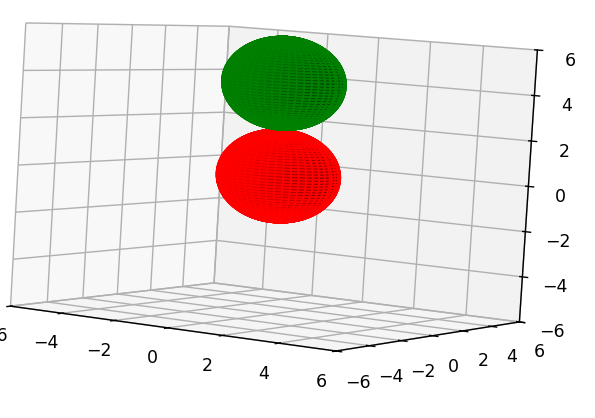

# Exercices graphique 3D

## Question 1

a) Faire le graphique 3D de la représentation d'une selle. La formule mathématique est $Z=X^2-Y^2$


Testez les paramètres, leur impact sur le résultat. Modifiez l'esthétisme.

b) Faire une 2e section (côte à côte ou haut et bas) au graphique et y mettre les courbes de niveau


## Question 2

a) Trouvez comment dessiner une sphère 3D avec des fonctions de numpy et matplotlib.

b) Empilez 2 sphères une par dessus l'autre dans le même graphique, de couleurs différentes. Elles doivent se toucher en exactement un point.



c) Faites un trio de sphères qui forment une structure de type bonhomme de neige proportionné: une sphère de taille de votre choix, une moyenne et une petite sur le dessus qui se touchent

d) Comment enlever la grille 3d derrière? Est-ce qu'on peut forcer le graphique à se présenter sous un angle choisi à l'affichage initial?


## Question 3

Voici un code par rapport auquel vous devez répondre aux questions plus bas

```py
import numpy as np
import matplotlib.pyplot as plt

x = np.linspace(-2, 2, 5)  
y = np.linspace(-2, 2, 5)  
X, Y = np.meshgrid(x, y)   
Z = np.array([[1,2,1,1.5,1.2],[1.1,2.5,2.7,2.5,1],[0.9,2.4,3,2.2,1.2],[1.2,1.5,2.5,1.3,1],[1,1.2,1.1,1,1]])

plt.imshow(Z, extent=(-2,2,-2,2))
plt.contour(X,Y,Z)
plt.show()
```

a) que fait la fonction imshow? Expliquer aussi le rôle de extent = (-2,2,-2,2)

b) écrire ce que vous comprenez du contenu de la variable Z

c) Comment enlever les lignes (courbes de niveau) de ce code?

d) Quelle est la valeur de Z pour le carré jaune?

e) Trouver comment changer la palette de couleur.

f) Quels sont les paramètres possibles de 


