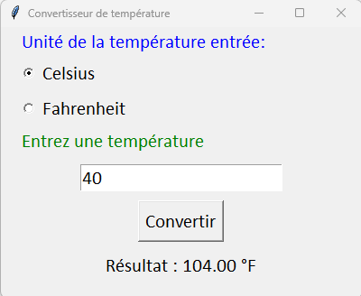

# Le convertisseur de température

Faire une fenêtre qui demande à un utilisateur de fournir une température en Celsius ou en Fahrenheit et afficher la conversion lors du clic d'un bouton.

Dans cet exercice, il y a 3 Labels, 2 Radiobutton, 1 Entry et un Button. 