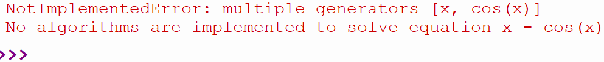
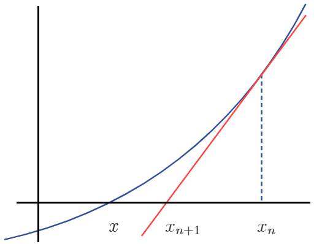

# Résolution d'équations

* Notes de cours inspirées du livre "La programmation en sciences de la nature" de S. Huneault, O. Rousseau et C. Varin

## Différentes approches

## Algébrique 

Depuis longtemps, on apprend à résoudre des équations mathématiques de façon algébrique. Par exemple, on résout l'équation suivante  $2x^2 -3x - 12 = 0$ avec la formule quadratique. Il est possible de la résoudre en quelques lignes avec Python également:

```py
import sympy as sp

x = sp.symbols("x")
y = 2*x**2-3*x-12

sol = sp.solve(y,x)
print(sol)
print(sol[0].evalf(), sol[1].evalf())
```

## Calcul symbolique

Cette méthode devient très utile pour des équations qui n'ont pas de solution algébrique comme $cos(x) - 5sin(x) - 1=0$

```py
x = sp.symbols("x")
sol = sp.solve(sp.cos(x) - 5*sp.sin(x) - 1, x)
print(sol)
print(sol[1].evalf())
```

Mais, ça ne fonctionne pas toujours...

```py
x = sp.symbols("x")
sol = sp.solve(x - sp.cos(x), x)
print(sol)
```


## Méthodes numériques

Il existe plein de méthodes numériques pour plusieurs classes d'équations.

## Méthode de Newton

Méthode numérique qui permet de trouver les racines d'une fonction continue et dérivable avec un point de départ choisit à tâtons, près d'un zéro. L'idée est la suivante:

- On cherche le moment où l'équation de la droite tangente à la courbe croise l'axe des x en s'approchant itérativement. 



Si on décortique l'équation d'une droite, on débute avec ceci: $y=ax+b$ ou bien $y=mx+b$

La pente de la tangente étant la dérivée de la fonction $f(x)=x^2-3x-10$ en bleu, on en déduit que l'équation de la droite tangente au point $(x_0,f(x_0))$ est 

$y=f'(x_0)(x-x_0)+f(x_0)$

Si on note son abscisse à l'origine (son zéro) par $x_1$, on a alors ceci:

$0=f'(x_0)(x_1-x_0)+f(x_0)$

En isolant le zéro $x_1$, on a:

$x_1 = x_0 - f(x_0)/f'(x_0)$


Globalement, 

$x_{n+1} = x_n - f(x_n)/f'(x_n) $

En mots:
- On choisit un $x_n$ relativement proche de la racine (zéro) choisie
- En appliquant la formule ci-haut, on obtient la valeur où la tangente croise l'axe des x (le zéro de la tangente), qu'on stocke dans $x_{n+1}$
- Avec la nouvelle valeur de x ($x_{n+1}$), on redessine une tangente et on recalcule le nouveau la valeur où la tangente croise l'axe des x (le zéro de la tangente). Ce sera ($x_{n+2}$)... et ainsi de suite


## Le code de la Méthode de Newton

Codons ensemble les étapes pour implémenter cette méthode:
1. Importer la librairie sympy
2. Définir la fonction
3. Définir la dérivée
4. Faire les calculs jusqu'à une convergence.

<br>
<br>
<br>
<br>
