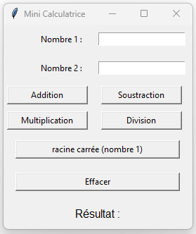
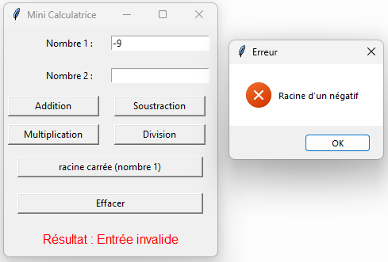

# Mini-calculatrice

Faire une mini-calculatrice qui fait les opérations suivantes et qui est disposé de la même manière:



Voici quelques trucs pour bien organiser cet exercice:

- il peut y avoir une seule fonction qui calcule les 5 opérations. Pour savoir quelle opération faire, envoyer un paramètre à la fonction lors de l'activation du bouton. Toute la logique et la gestion de l'affichage peut être à la même place.
  - Il faut utiliser try except pour les possibles erreurs mathématiques comme la division par 0, la racine d'un négatif ou les entrées qui ne sont pas des chiffres. Il ne faut pas que l'application plante. 

- en tout temps, il faut essayer de mettre le texte en nombre et afficher un message d'erreur lorsque ce n'est pas possible. Les erreurs doivent apparaître dans le Label et il DOIT y avoir un popup qui avertit de l'erreur.
  


- pour remettre tout à 0 (bouton effacer), voici une suggestion:
```py
def effacer():
    entry1.delete(0, tk.END)
    entry2.delete(0, tk.END)
    label_resultat.config(text="Résultat :", fg="black")
```

- créer tous les widgets et placez-les dans des grids ensuite.