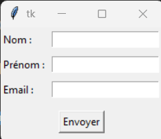

# Disposition avec grid() en Tkinter

En Tkinter, le gestionnaire de positionnement grid() permet d’organiser les widgets dans une grille composée de lignes et de colonnes. Il est plus précis que pack() et facilite l’alignement des éléments.

```py
import tkinter as tk

fenetre = tk.Tk()
#fenetre.geometry("200x100")

label1 = tk.Label(fenetre, text="Nom :")
label1.grid(row=0, column=0)

entree1 = tk.Entry(fenetre)
entree1.grid(row=0, column=1)

bouton = tk.Button(fenetre, text= "bouton")
bouton.grid(row = 1,column=0)
fenetre.mainloop()
```

### Quelques options utiles:
| Option      | Description |
|------------|-------------|
| `row` | Numéro de ligne (commence à 0). |
| `column` | Numéro de colonne. |
| `padx`, `pady` | Ajoute de l’espace autour du widget. |
| `sticky` | Définit l’alignement (`N, S, E, W` ou combinaison). |
| `columnspan` | Étend le widget sur plusieurs colonnes. |
| `rowspan` | Étend le widget sur plusieurs lignes. |


Exemple:
```py
import tkinter as tk

fenetre = tk.Tk()
#fenetre.geometry("200x100")

label1 = tk.Label(fenetre, text="Nom :")
label1.grid(row=0, column=0, padx = 10,pady = 10)

entree1 = tk.Entry(fenetre)
entree1.grid(row=0, column=1,padx = 10,pady = 10)

bouton = tk.Button(fenetre, text= "bouton")
bouton.grid(row = 1, padx = 10,pady = 10, columnspan=2, sticky="ew")
fenetre.mainloop()
```

# Exercice

Reproduire ceci: 

