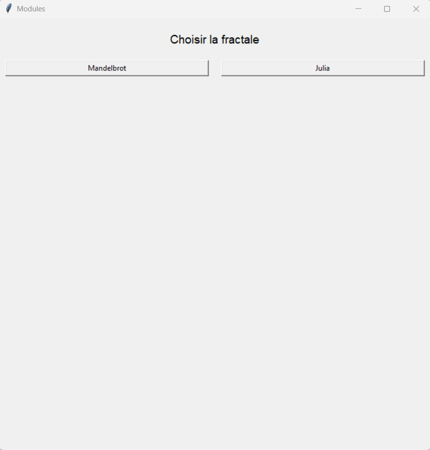
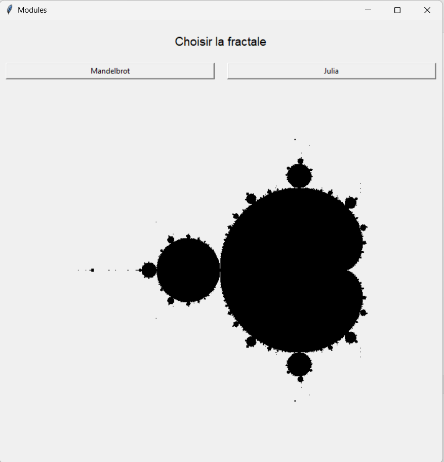
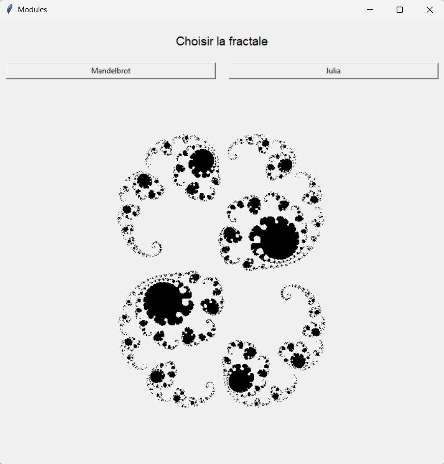

# Exercice module

À remettre dans un dossier .zip avec les 4 modules suivants, séparés: 
- mandelbrot.py
- julia.py
- interface.py
- main.py

Les 2 fichiers séparés contenant le code pour dessiner un [ensemble de Mandelbrot](https://fr.wikipedia.org/wiki/Ensemble_de_Mandelbrot) et un [ensemble de Julia](https://fr.wikipedia.org/wiki/Ensemble_de_Julia).

Vous avez comme tâche de créer une interface qui va proposer 2 boutons qui permettront de voir un ou l'autre des ensembles quand on clique sur ceux-ci:

Avant:


en cliquant sur Mandelbrot



en cliquant sur julia:




votre fichier main.py ne contiendra presque rien. Il devra déclencher l'affichage de l'interface seulement.
Dans votre interface, pour afficher l'objet de dessin, vous devrez ajouter un widget canvas. cet objet est déjà présent dans les fichiers mandelbrot.py et julia.py. Il faudra que cet objet se retrouve dans la même fenêtre que les boutons et le titre. 

```py
canvas = tk.Canvas(fenetre, ...)
canvas.grid(...)
```

Pour réussir à modifier le widget ailleurs que dans la fonction où il se trouve, on va le *passer en paramètre* (obligatoire pour avoir tous les points) quand on active un bouton (command).

Vous pouvez modifier la présentation de l'interface comme bon vous semble, mais le code des dessins de Mandelbrot et julia doivent rester dans leur modules (fichiers) respectifs.