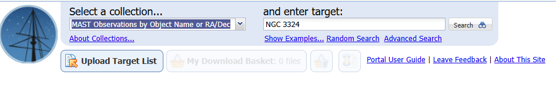
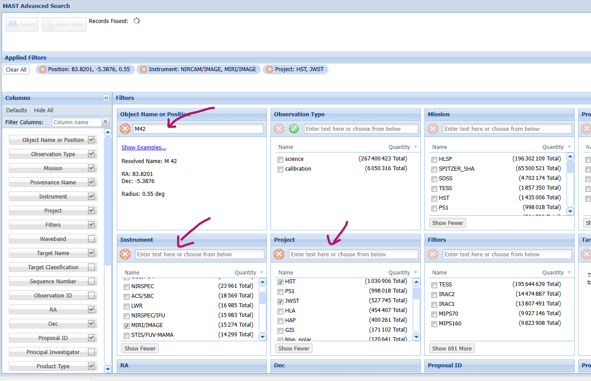
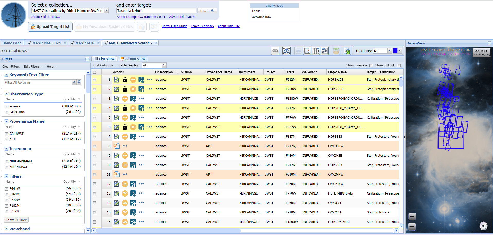
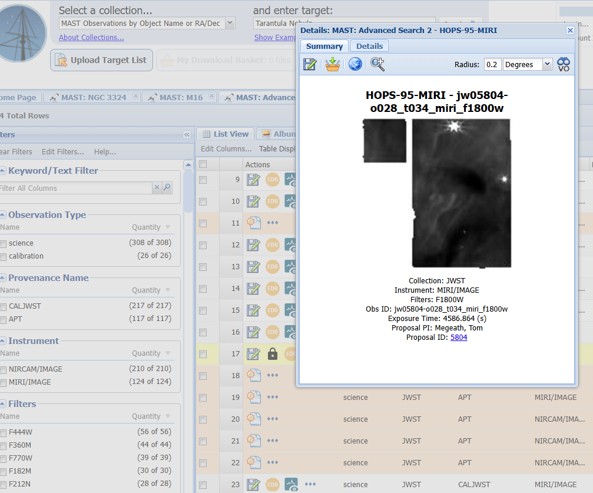
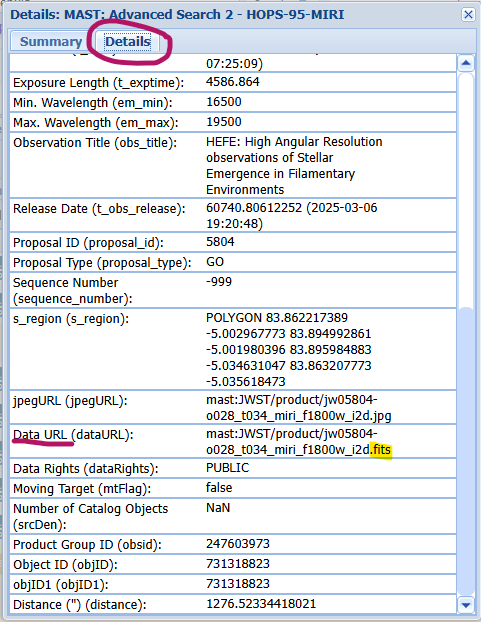
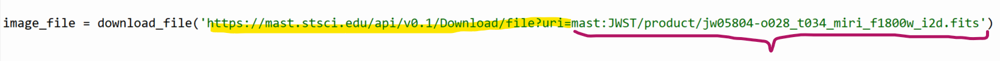

# Manipulation et affichage d'images astronomiques au format FITS


Pour manipuler et afficher des images astronomiques au format FITS en Python, il faudra importer les bibliothèques astropy, matplotlib et numpy. Nous verrons comment télécharger des fichiers FITS, extraire leurs données et les visualiser avec différentes échelles d'affichage.

## Bibliothèques requises

Avant d'exécuter le code, on doit installer astropy. Dans outils/ouvrir la console du système, mettre la commande suivante:

```
pip install astropy
```

## 1- Importation des bibliothèques

Nous devons importer plusieurs modules pour gérer les images FITS et les afficher :

```py
import numpy as np
import matplotlib.pyplot as plt
from astropy.io import fits
from astropy.utils.data import download_file
from matplotlib.colors import LogNorm
```

## 2-Téléchargement et ouverture d'une image FITS

Les fichiers FITS (Flexible Image Transport System) sont couramment utilisés en astronomie pour stocker des images et des métadonnées.

```py
image_file = download_file('http://data.astropy.org/tutorials/FITS-images/HorseHead.fits', cache=True)
hdu_list = fits.open(image_file)
hdu_list.info()
```

- download_file() télécharge un fichier FITS depuis une URL.

- fits.open() ouvre le fichier et charge son contenu dans une liste de HDU (Header Data Unit).

- hdu_list.info() affiche des informations sur les différentes unités de données contenues dans le fichier.

On peut se créer une variable image_data, un array de numpy en 2D, qui va garder les données dont on a besoin, et ensuite fermer le fichier fits, pour éviter d'utiliser inutilement des ressources:

```py
image_data = hdu_list[0].data
hdu_list.close()
```
On peut afficher les métadonnées, comme la date, le télescope, etc. en faisant ceci:

```py
print(repr(hdu_list[0].header))
```

On pourrait également prendre un raccourci si on n'a pas besoin de connaître les éléments dans les métadonnées:

```py
image_data = fits.getdata(image_file)
```
### Afficher l'image

Pour afficher le résultat de l'image de la matrice de pixels image_data:

```py
plt.imshow(image_data, cmap='gray')
plt.colorbar()
plt.show()
```
### Afficher l'image avec une échelle log

On peut appliquer la normalisation logarithmique pour mieux visualiser les faibles intensités:

```py
plt.imshow(image_data, cmap='gray', norm=LogNorm())
cbar = plt.colorbar(ticks=[5.e3,1.e4,2.e4])
cbar.ax.set_yticklabels(['5,000','10,000','20,000'])
plt.show()
```


## 3-Transformation des données en 1D et histogramme des intensités

```py
print(type(image_data.flatten())) #montre le type (array 1D) de l'applatissement de la matrice 2D en 1D
print(image_data.flatten().shape) #renvoi le résulat de la multiplication des 2 dimensions de la matrice, en pixels. (Matrice 3X3 -> renvoie 9)

plt.hist(image_data.flatten(), bins='auto', color='blue', alpha=0.7) # bins='auto' fait choisir le nombre de classes.
plt.title('Histogramme des intensités des pixels')
plt.xlabel('Valeurs des pixels')
plt.ylabel('Fréquence')
plt.grid(True)
plt.show()
```

## 4-Télécharger plusieurs images 

On peut télécharger plusieurs image et les additionner pour améliorer le rapport signal/bruit

```py
# Aller chercher une série d'images
base_url = 'http://data.astropy.org/tutorials/FITS-images/M13_blue_{0:04d}.fits'

#affichage des url (test)
for i in range(1, 5+1):
    url = base_url.format(i)
    print(url)


image_list = []  # Initialisation de la liste des fichiers téléchargés
for n in range(1, 5 + 1):  # Boucle sur les valeurs de 1 à 5
    file_path = download_file(base_url.format(n), cache=True)  # Téléchargement du fichier
    image_list.append(file_path)  # Ajout du chemin du fichier à la liste

image_concat = []  # Initialisation de la liste des données FITS
for image in image_list:  # Boucle sur chaque fichier téléchargé
    image_data = fits.getdata(image)  
    image_concat.append(image_data)  
```

# Trouver des images en ligne

Le site MAST ([Mikulski Archive for Space Telescopes](https://mast.stsci.edu/portal/Mashup/Clients/Mast/Portal.html)) est un portail d’archives astronomiques géré par le Space Telescope Science Institute (STScI). Il permet d’accéder à une vaste base de données contenant des observations astronomiques issues de divers télescopes spatiaux et missions scientifiques, notamment :

- Hubble Space Telescope (HST)
- James Webb Space Telescope (JWST)
- Transiting Exoplanet Survey Satellite (TESS)
- Kepler et K2
- Galaxy Evolution Explorer (GALEX)
- Autres missions de la NASA et collaborations internationales


1- On se rend sur le site https://mast.stsci.edu/portal/Mashup/Clients/Mast/Portal.html 

2- On peut sélectionner des collection, faire des recherches de plusieurs manières (À explorer!). Notre but est de trouver des images .fits

Exemple:

3- On sélectionne "MAST Observations by Object Name or RA/Dec" dans la rubrique "Select a collection". On sélectionne un nom d'objet



Les objets (nébuleuses, galaxies, étoiles, exoplanètes, trou noirs) sont multiples! Voici quelques exemples:

Les nébuleuses célèbres:

- Orion Nebula (M42)
- Horsehead Nebula (Barnard 33)
- Eagle Nebula (M16, includes the Pillars of Creation)
- Carina Nebula (NGC 3372, includes NGC 3324)
- Crab Nebula (M1, supernova remnant)
- Tarantula Nebula (NGC 2070, in the Large Magellanic Cloud)
- Bubble Nebula (NGC 7635)
- Butterfly Nebula (NGC 6302, planetary nebula)
- Cone Nebula (NGC 2264)
- Rosette Nebula (NGC 2237)
- Owl Nebula (M97, planetary nebula)
- Helix Nebula (NGC 7293, "Eye of God")

Dans le menu "advanced search", on peut aussi trier par mission ou par instrument. On peut choisir, par exemple, les missions James Web Satellite Telescope (JWST) ou Hubble Satellite Telescope (HST). Les instruments NIRCam ou MIRI peuvent aussi être choisis, par exemple.



Quand la recherche correspond, peser sur "search" en haut à gauche. Un liste va alors se charger.



On peut alors voir les détails de chaque image (les ...):



Dans l'onglet détails, on cherche une URL qui finit par .fits et on la copie. 



On peut ensuite venir la placer dans notre code, dans download_file. Ne pas oublier le préambule du site web:

```py
image_file = download_file('https://mast.stsci.edu/api/v0.1/Download/file?uri=mast:JWST/product/jw05804-o028_t034_miri_f1800w_i2d.fits')
```



Et voilà! Vous êtes prêts à fouiller les images des confins de l'univers! Attention de ne pas vous y perdre! 

Lien intéressants:

La NASA explique et vulgarise très bien le détails des missions et leurs développement:

- Photos de la mission Hubble (35 ans en images): https://science.nasa.gov/mission/hubble/hubble-news/hubble-social-media/35-years-of-hubble-images/

- La mission James Web: https://science.nasa.gov/mission/webb/ 