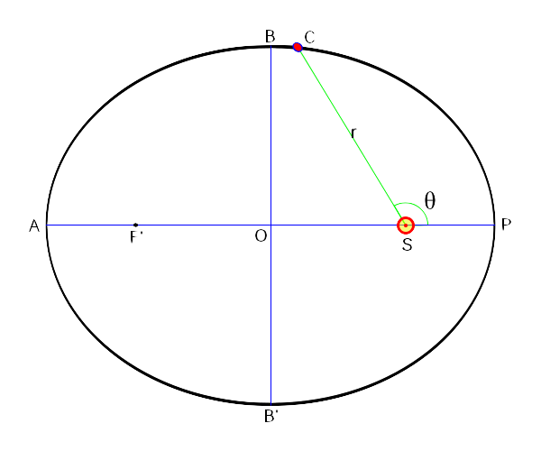
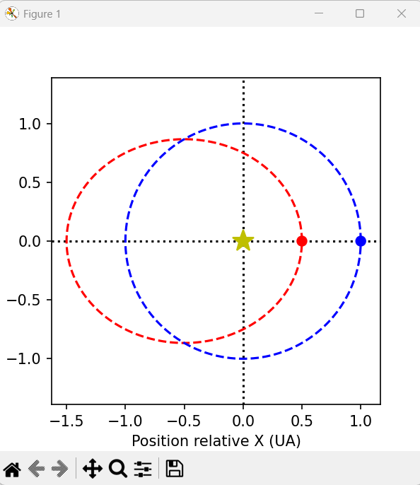
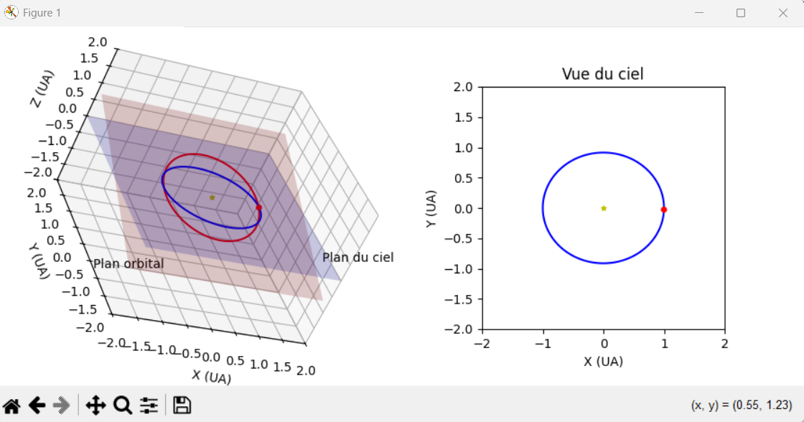
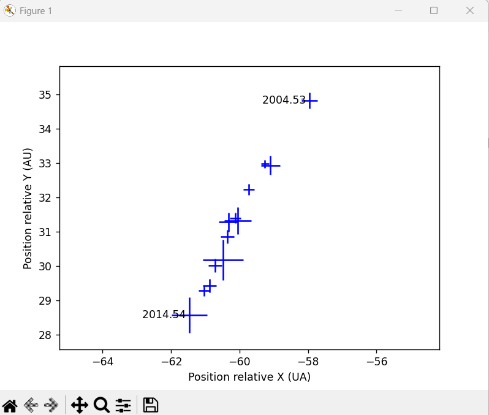
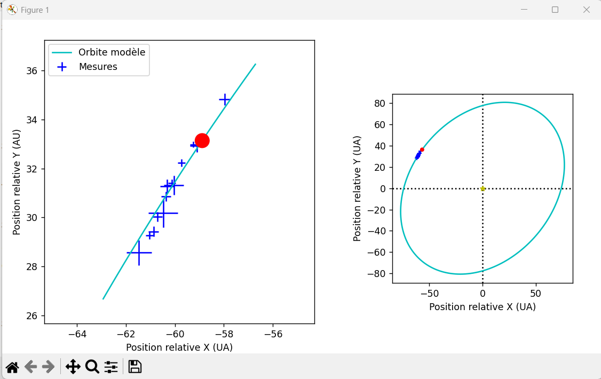
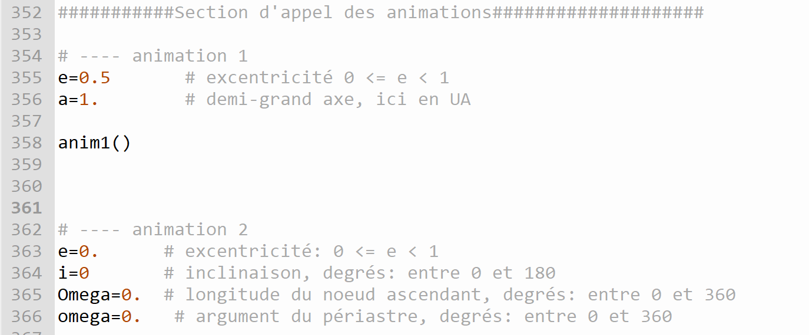
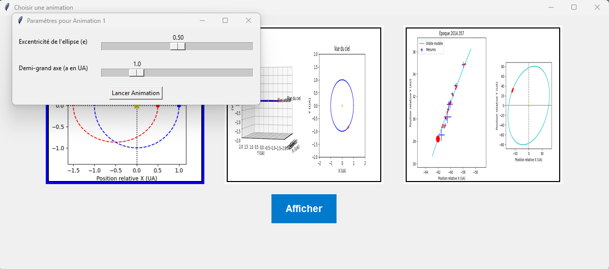

Ce fichier explicatif provient d'un enseignant qui donne un cours d'introduction à Python en astrophysique à l'université McGill. 

## Orbites planétaires

Sans perturbation extérieure, le mouvement d'une planète autour de son étoile se fait dans un plan, que l'on appelle le plan orbital. Commençons donc par définir un système de coordonnées $x^\prime y^\prime z^\prime$ dont le plan $x^\prime-y^\prime$ correspond au plan orbital de la planète. Vous savez aussi que, d'après les lois de la gravitation, l'orbite d'une planète autour de son étoile a la forme d'une ellipse dont l'étoile est située à l'un de ses foyers. Plaçons donc l'origine de notre système de coordonnées à ce foyer, i.e. à la position de l'étoile, et orientons l'axe des $x^\prime$ dans la direction du point de l'orbite le plus rapproché de l'étoile, ce dernier point étant appelé le __périastre__. Enfin, considérons les coordonnées polaires $r$ et $\theta$ pour noter la position de la planète; dans le contexte d'une planète en orbite, l'angle $\theta$ est appelé "l'__anomalie vraie__". Dans ce système de coordonnée l'équation de l'orbite de la planète est,

$$
r(\theta) = \frac{a(1 - e^2)}{1 + e \cos{\theta}} \quad\quad \text{(1)}
$$


où
$a$ est le __demi-grand axe__ de l'ellipse (la moitié du plus grand diamètre) et $e$ est l'__excentricité__ de l'ellipse (qui indique à quel point l'ellipse est "aplatie"). La figure suivante illustre schématiquement l'orbite et les diverses quantités introduites.



[source](http://www.astro.umontreal.ca/~david/jirp/schemaOrbite.png) 

Schéma de l'orbite elliptique d'une planète autour d'une étoile, dans le plan orbital. L'étoile est située au point S qui correspond à un des deux foyers de l'ellipse et la planète est située au point C. Les coordonnées polaires de la planètes sont $r$ et $\theta$; la coordonnée angulaire $\theta$ est appelée anomalie vraie dans le contexte d'une planète en orbite. La coordonnée $r$ correspond à la distance entre la planète et l'étoile.
L'__apoastre__ est le point A de l'orbite où l'exoplanète est la plus éloignée de l'étoile, et le __périastre__ le point (opposé) P où elle se trouve à sa plus petite distance de l'étoile. La segment de droite reliant l'apoastre au périastre (et qui passe par les foyers de l'ellipse) définit l'axe majeur de l'ellipse. Sa moitié
est appelée le __demi-grand axe__, dénoté $a$. Dans la limite d'une orbite circulaire, $a$ devient égal au rayon du cercle orbital. L'__excentricité__ de l'orbite est une mesure du degré d'allongement de l'ellipse, sa valeur numérique étant définie comme le rapport de la distance entre les foyers et le grand axe de l'ellipse ($=2a$). Une orbite circulaire a donc une excentricité de zéro, et l'excentricité ne peut pas dépasser 1 (les foyers doivent se trouver à l'intérieur de l'ellipse!).
Les axes cartésiens $x^\prime$ et $y^\prime$ de ce référentiel correspondent aux segments OP et OB, respectivement.

L'équation ci-haut décrit l'orbite d'un point de vue géométrique, $r$ vs $\theta$. Pour ajuster une orbite planétaire sur nos mesures de position de planète à différents temps, nous aurons besoin de décrire la position de la planète en fonction du temps $t$, soit $r(t)$ et $\theta(t)$, ce qui est un peu plus compliqué. Allons-y!

D'abord, on définit une nouvelle variable, l'__anomalie moyenne__ $M$, comme étant la fraction de la période orbitale écoulée depuis le passage au périastre et exprimée en radians, soit,

$$
M = 2\pi \frac{t - T_0}{P} \quad\quad \text{(2)}
$$


où $P$ est la période orbitale et $T_0$ est un temps de référence auquel l'anomalie moyenne (et vraie) est 0. La période orbitale $P$ est reliée au demi-grand axe $a$ de l'orbite par la __3e loi de Kepler__,

$$
P^2 = \frac{4\pi^2}{G} \frac{a^3}{M_\star} \quad\quad \text{(3)}
$$


où $G$ est la constante gravitationnelle et $M_\star$ est la masse de l'étoile. Pour simplifier un peu les choses, nous exprimerons toutes les distances en unité astronomique (abréviation UA; 1 UA $=1.49597892 \times 10^{11}$ m, soit la distance moyenne Terre--Soleil), les temps en années terrestres, et la masse de l'étoile en masse solaire (symbole $M_\odot$; 1 $M_\odot=1.989\times 10^{30}$ kg). Lorsque $P$, $a$ et $M_\star$ sont exprimés selon ces unités, la 3e loi de Kepler se simplifie à,

$$
P^2 = \frac{a^3}{M_\star} \quad\quad \text{(4)}
$$


L'anomalie moyenne est utile car elle peut être calculée trivialement à partir de $t$, et évolue linéairement avec celui-ci. À son tour, l'anomalie moyenne permet de calculer l'__anomalie excentrique__, $E$, en solutionnant l'__équation de Kepler__,

$$
M = E - e \sin{E} \quad\quad \text{(5)}
$$


(Si ça vous intéresse, l'anomalie excentrique $E$ est définie comme l'angle de la position de la planète projetée sur un cercle de rayon $a$ concentrique avec l'ellipse (appelé cercle auxiliaire), mesuré à partir du centre de l'ellipse et par rapport à la direction du périastre. La valeur de $E$ va de 0, lorsque la planète est au périastre, et augmente graduellement de façon non-linéaire avec le temps pour atteindre $2\pi$ à la complétion de l'orbite.)

Enfin, avec la valeur de $E(t)$, il est possible de calculer la position de la planète au temps $t$ avec les équations suivantes,

$$
r = a(1 - e \cos E) \quad\quad \text{(6a)}
$$

$$
\theta = 2 \arg\left( \sqrt{(1-e)} \cos{\frac{E}{2}}, \sqrt{(1+e)} \sin{\frac{E}{2}} \right) \quad\quad \text{(6b)}
$$

où $\arg(x,y)$ est une fonction qui retourne l'angle polaire du vecteur de composante $(x,y)$.

En coordonnées cartésiennes, la position de la planète est donnée par,

$$
x' = r \cos{\theta} \quad\quad \text{(7a)}
$$

$$
y' = r \sin{\theta} \quad\quad \text{(7b)}
$$


# Travail à faire:
# Partie 1
- À partir des formules et explications ci-haut, compléter le fichier Python, là où vous voyez une lettre entre parenthèses suivi de la mention À COMPLÉTER en commentaire. 

- Ensuite, programmer la résolution d'équation de Kepler (5) ci-haut avec la méthode de Newton-Raphson vue en classe. La variable dans l'équation de Kepler est l'anomalie excentrique $E$. Les 2 autres valeurs sont des constantes. Voici les étapes à suivre:

- Dans la fonction ci-dessous, des paramètres sont déjà fournis. Il faudra s'y conformer et ne rien modifier des noms ou des positions ou des valeurs de ces paramètres. 

```py
def calcAnomE(M,e,epsilon=1.e-10,iterMax=25)

    # (e) COMPLÉTER la résolution de l'équation de Kepler
    # Déclaration du E initial


    # Vérification


    # Boucle de Newton


return E
```
Paramètres (description): 
- $M$ est l'anomalie moyenne fournie lors de l'appel à cette fonction
- $e$ est l'excentricité de l'ellipse
- epsilon est la valeur utilisée pour la différence entre la réponse obtenue et la réponses précédente (la différence).
- iterMax est le nombre d'itérations maximales à faire dans la boucle de Newton avant de conclure qu'il n'y a pas de solution. Si aucune valeur est fournie à ce paramètre, il sera de 25 par défaut.

Déclaration du E initial (à coder):
- Si $M$ est plus petit que pi, on fixe la valeur de départ de $E$ à $M+e/2$. Sinon, on fixe $E$ de départ à $M-e/2$. 

Vérification (à coder):
- Si la valeur absolue du résultat de l'équation de Kepler quand on y remplace E par sa valeur initiale est plus petite que  $1x10^-12$, retournez E directement. 

Boucle de Newton:
- faire la boucle de Newton pour résoudre l'équation et trouver E, s'il existe. Il n'est PAS obligatoire de faire des fonctions f et f_prime à part du code de la fonction. Vous pouvez utiliser les expressions directement dans la boucle, à votre guise.

**IMPORTANT** : peu importe le nom donné à la variable de retour, elle doit retourner la valeur de E, qui est l'anomalie excentrique.

AUCUN AUTRE code à changer dans ce programme pour qu'il fonction à ce point-ci.

Pour vérifier que ça fonctionne, vous devriez voir tour à tour les images animées semblables à ceci:









> Si vous avez ce message d'avertissement en console, ignorez-le: "Ignoring fixed x limits to fulfill fixed data aspect with adjustable data limits."

### animation 1
Cette animation permet de visualiser le mouvement orbital d'une planète selon les paramètres $a$ et $e$. 

La planète de référence en bleu a une orbite ayant $e=0$ et $a=1$ comme paramètre. 

### animation 2
Cette animation permet de visualiser le mouvement orbital en 3D selon l'inclinaison $i$, l'argument du périapse $omega$, la longitude du nœud ascendant $Omega$ et l'excentricité de l'orbite $e$. 

À la partie gauche de l'animation (en 3D), le plan du ciel est montré en bleu, et l'orbite projetée sur le plan du ciel est montrée par l'ellipse bleue. Le plan orbital est montré en rouge et l'orbite exacte tridimensionnelle est montrée par l'ellipse rouge. Au tout début de l'animation, l'image fige pendant 3 seconde sur une perspective "vue du ciel", c'est-à-dire comme nous voyons l'orbite en regardant le ciel, puis l'animation change le point de vue pour révéler l'orientation tridimensionnelle de l'orbite, pour finir avec un point de vue perpendiculaire au plan du ciel.

À la partie droite de l'animation, on voit en tout temps notre perspective 2D de "vue du ciel".

Après l'animation, vous pouvez modifier l'angle de vue de la figure en cliquant et glissant le pointeur sur le graphique.

### animation 3

détermination de l'orbite d'une exoplanète à partir de mesures.

Ici, on a utilisé les mesures des positions des planètes du système HR 8799 (lequel contient 4 planètes), et il est possible de déterminer les paramètres de l'orbite de chacune d'elles en comparant une orbite calculée aux mesures.

La fonction chargerDonnees(pl) charge et affiche les mesures de la position projetée sur le ciel pour une des planètes du système. Pour sélectionner une planète ou une autre, spécifiez la lettre correspondante à la variable pl ('b', 'c', 'd' ou 'e').

Le centre des symboles marque la position mesurée et la longueur des traits des symboles marque l'incertitude sur la position mesurée. Notez que les mesures couvrent seulement une toute petite partie de l'orbite, et que l'étoile n'est pas visible sur cette figure (elle serait à la position 0,0).

#### Explication de la figure/animation

Les positions mesurées sont affichées par des croix bleues. La position de la planète est indiquée par un cercle rouge et l'orbite modèle par un trait turquoise. Le panneau de gauche montre un agrandi sur la portion de l'orbite où il y a des mesures, tandis que le panneau de droite montre l'orbite complète.

Au fil de l'animation, lorsque la planète franchit un temps où une mesure est disponible, sa position est fixée sur la figure par un point rouge et est reliée par un trait rouge à la mesure correspondant à ce temps. Pour avoir un bon accord entre l'orbite modèle et les mesures, il faut que les points rouges soient le plus près possible de leur croix bleue correspondante.

À la fin de l'animation, le titre de la figure change pour afficher la qualité de l'accord entre l'orbite modèle et les mesures de position de la planète. Plus ce chiffre est élevé, plus l'accord est bon. Une valeur autour de 1 est un excellent accord. La qualité du modèle est aussi indiquée dans le texte juste au-dessus de la figure.

# Partie 2

CONSEIL: Gardez une copie de **sauvegarde** de votre fichier de la partie 1 avant de déplacer les éléments.

Séparer le fichier initial en minimalement 3 modules distincts:
- un module avec les animations
- un module avec les fonctions calcOrbite(p,t,mEtoile) et calcAnomE(M,e,epsilon=1.e-10,iterMax=25)
- un module avec le main() et l'interface (voir partie 3). (possible de séparer ces 2 modules si désiré)

Vous devez vous assurer que le code fonctionne quand on déplace la section d'appel des animations du fichier initial dans le module main()



# Partie 3

Interface: Dans le module main() (ou dans un module à part si désiré).

- Faire une interface qui utilise une image cliquable pour faire un choix. Les images choisies peuvent être n'importe lesquelles, pourvu qu'il soit écrit quelque part quelle animation est sélectionnée. 

- Ce clic mènera vers un **formulaire** pour moduler les différentes valeurs de $a$ et de $e$ de l'animation 1, les valeur de $e$, $i$, $Omega$ et $omega$ de l'animation 2 ainsi que les valeurs de $a$, $e$ et $i$ de l'animation 3. Les *slider* sont une option à considérer, sinon des *entry* peuvent aussi faire l'affaire. Il faudra alors gérer les erreurs d'entrée.

Exemple:


# Spécifications toutes les parties

- il doit y avoir au moins un try... except pertinent dans le code modifié, le main ou l'interface.
- les variables doivent suivre les conventions du document explicatif. 
- le style est les couleurs de la fenêtre, des boutons, des contours est laissé à votre discrétion.
