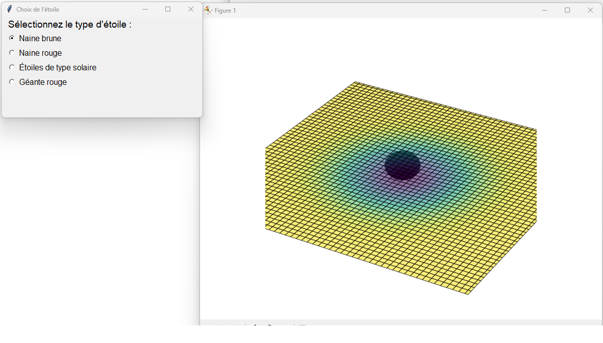
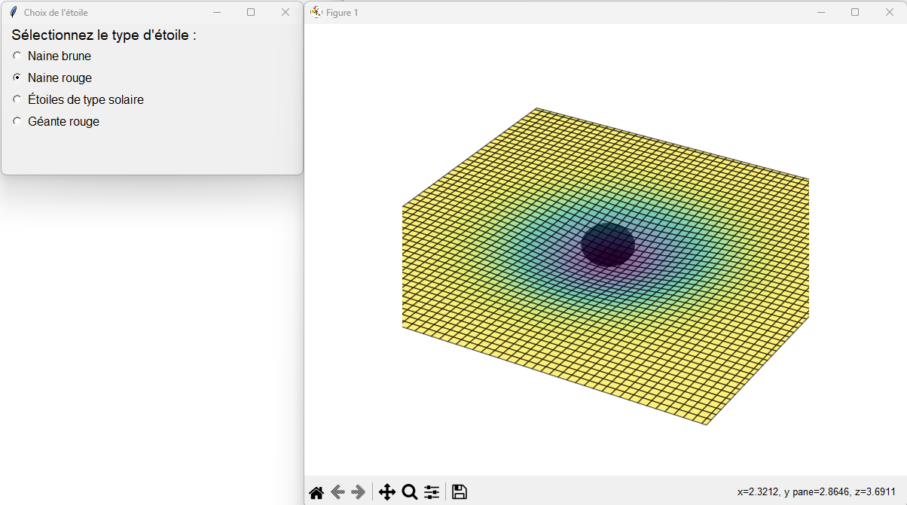
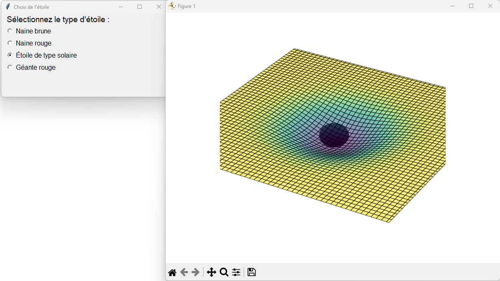
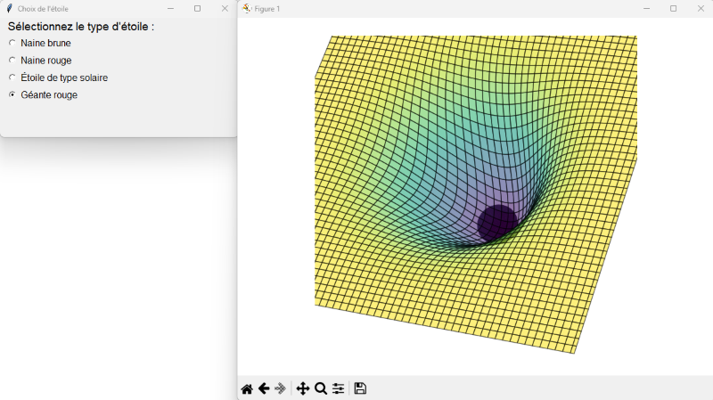

# Travail pratique 1 (5%)

Objectif du travail :
-	Explorer les fonctionnalités de graphique 
-	Rechercher des solutions en ligne, les adapter et les appliquer
-	Explorer les fonctionnalités d’interface


Vous devez proposer un petit programme qui simule la courbure de l’espace-temps qui se produit autour d’un astre massif. (relativité générale d'Einstein, https://fr.wikipedia.org/wiki/Relativit%C3%A9_g%C3%A9n%C3%A9rale). 

Le programme doit comprendre une interface simple au démarrage avec 4 options minimum. Les options permettront de choisir la grosseur (la masse) approximative d’une étoile dans le calcul de déformation de l’espace-temps. 
Il y a plus d’une façon de simuler la déformation de l’espace-temps. Vous êtes totalement libres de résoudre ce problème à votre guise. Les lignes suivantes sont des suggestions pour la résolution :

*Une des façons* de faire est de créer une grille en 3D dont 2 des axes (X et Y) sont fixes et dont le 3e (Z) suit la formule suivante : $Z = -M * \exp\left(-\frac{X^2 + Y^2}{4}\right)$
avec M qui simule la masse de l'étoile. Il existe d'autres formules, ne vous limitez pas à celle-ci.

Dans les exemples ci-dessous, la valeur de M pour 
- une naine brune : 0.08
- une naine rouge : 0.5
- une étoile solaire : 1.2
- une géante rouge : 6

Vous pouvez en mettre plus, engendrer un changement de couleur selon le choix, changer les axes, etc. Personnalisez votre projet.







# Consignes:

- Vous avez droit à TOUT pour faire ce travail (je vous encourage à fouiller, à utiliser l'intelligence artificielle également)
- Le but est de remettre un code fonctionnel et DE LE COMPRENDRE.
- Vous êtes libres de changer plusieurs éléments, de prendre l'approche que vous voulez avec l'esthétisme que vous voulez. 
- Il est pratiquement impossible de voir 2 codes identiques. Attention au plagiat, celui-ci entraînera la note de 0. Le plagiat est la copie intégrale du travail de quelqu'un d'autre. 


# Remise
- **Le code** est à remettre au plus tard le **dimanche 9 mars à minuit**. Vous aurez ensuite un rendez-vous à prendre avec moi pour m'expliquer le fonctionnement global de votre code et répondre à mes questions
- Dans la remise, je n'ai besoin que du fichier .py contenant votre code. Vous devez inclure une en-tête en commentaire et y mettre les sites et références utilisées.

```py
#Nom:
#Références utilisées:
```

- Une fois la remise effectuée, vous devez prendre un rendez-vous de 15 à 30 minutes avec moi dans les 2 semaines suivantes. Mes disponibilités générales sont:

- le lundi AM
- le mardi toute la journée
- le mercredi AM
- le jeudi AM
- le vendredi PM

Confirmez votre rendez-vous avec moi par Mio.

# Critères de correction

Le poids des points alloués est décrit dans la feuille Excel présent dans ce dossier.
